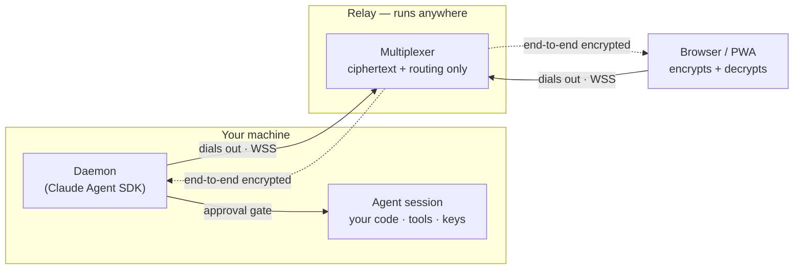

# telecode

**Launch, watch, and steer Claude Code agents on your own machine — from any browser.**

telecode is an open-source, self-hostable command center for coding agents. The agents run on _your_
computer, where your code already is; a responsive web app (an installable PWA — no native app) lets you
launch them, watch them work, and approve each consequential action from your phone or another laptop.
Session content is end-to-end encrypted, so the server in the middle only ever forwards ciphertext.

## Why it's built this way

- **Execution stays on your machine.** Agents run locally, with your tools and credentials. There is no
  cloud execution — that's a product promise, not a detail.
- **Outbound-only.** Both your machine (the daemon) and your browser dial _out_ to a relay; nothing ever
  reaches _into_ your machine. No ports to open, no inbound access.
- **End-to-end encrypted.** Prompts, output, diffs, and transcripts are encrypted in the browser and the
  daemon. The relay sees only routing metadata (see the [threat model](docs/threat-model.md)).
- **You hold the gate.** Every consequential tool call pauses for your approval before it runs.
- **Open and self-hostable.** Run the whole thing yourself; the relay is the only piece that could live
  elsewhere, and even then it sees only ciphertext.

## How it fits together

| Part       | Role                                                                                           |
| ---------- | ---------------------------------------------------------------------------------------------- |
| **Daemon** | Runs on your machine via the Claude Agent SDK; spawns and supervises agent sessions.           |
| **Relay**  | A stateless multiplexer + device/session registry. Forwards ciphertext; never runs agents.     |
| **Web**    | A SvelteKit PWA: launch sessions, watch the stream, approve tool calls, steer with follow-ups. |



Both the browser and the daemon **dial out** to the relay — nothing reaches into your machine. The relay
multiplexes encrypted frames between them and can't read any of it; agent work, your code, and your keys
never leave your machine.

## Quick start

1. **Run the daemon** on the machine you want to control — it prints a pairing code. _(The published
   `telecode` command is on the way; until then, run it from a clone with `make run` — see
   [Getting started](docs/getting-started.md).)_
2. **Open the web app**, sign in, and enter the pairing code to bind the machine to your account.
3. **Launch a session**, then approve actions as they come and steer with follow-up messages.

Check a machine's setup any time with `telecode doctor` (Node version, API key, pairing, relay
reachability).

→ Full walkthrough: **[docs/getting-started.md](docs/getting-started.md)**

## Documentation

- [Getting started](docs/getting-started.md) — install, pair, and run your first session.
- [Reconnecting & offline behavior](docs/reconnect-and-offline.md) — what happens on reload, network
  drops, and laptop sleep.
- [Self-hosting the relay](docs/self-hosting.md) — run your own relay with Docker.
- [Threat model](docs/threat-model.md) — what each part can and cannot see, and how to verify it.
- [Telemetry & privacy](docs/telemetry.md) — telecode collects nothing by default.
- [Publishing the CLI](docs/publishing.md) — maintainer runbook for shipping the `telecode` command.

## Contributing

Contributions are welcome — see [CONTRIBUTING.md](CONTRIBUTING.md) for setup and the change bar, and the
[Code of Conduct](CODE_OF_CONDUCT.md). Found a security issue? Please report it privately per the
[Security Policy](SECURITY.md). Release history lives in the [CHANGELOG](CHANGELOG.md).

## Development

telecode is a TypeScript monorepo (pnpm workspaces + Turborepo): a SvelteKit web app, a Fastify + `ws`
relay, a Claude Agent SDK daemon, and a shared protocol/crypto package.

```sh
make setup   # install workspace dependencies
make run     # start the relay, a local daemon, and the web app
make test    # run the test suites
make stop    # stop the local stack
```

## License

telecode is free software, licensed under the **GNU Affero General Public License v3.0**. See
[LICENSE](LICENSE).
