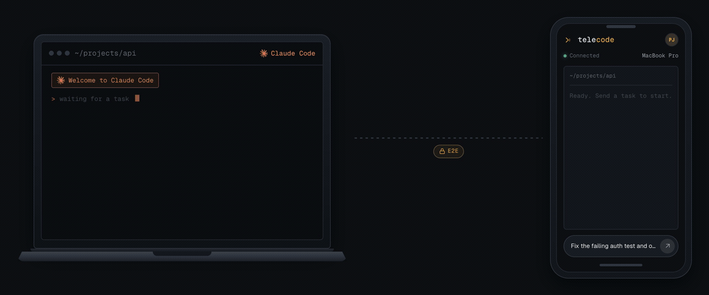
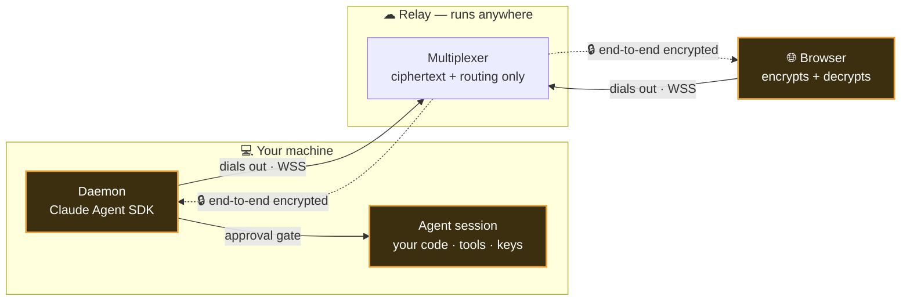

<div align="center">


# telecode

**Launch, watch, and steer Claude Code agents on your own machine — from any browser.**

The agents run on _your_ computer, where your code already is. A responsive, mobile-first web app — no
native app — lets you launch them, watch them work, and approve each consequential action from your
phone or another laptop. Session content is **end-to-end encrypted**, so the server in the middle only
ever forwards ciphertext.

[](LICENSE)
[](https://www.npmjs.com/package/@telecode/cli)
[](packages/protocol)
[](apps/web)
[](apps/relay)
[](packages/daemon)
[](docs/end-to-end-encryption.md)

[Why](#why-its-built-this-way) ·
[What you can do](#what-you-can-do) ·
[Architecture](#architecture) ·
[How it connects](#how-it-connects) ·
[Quick start](#quick-start) ·
[Security](#security--privacy) ·
[Docs](#documentation)

<br/>



</div>

---

## Why it's built this way

Remote-control tools for coding agents usually run the agent **in the cloud** and ask you to trust a
closed service with your code and your keys. Telecode inverts that: the agent runs **where your code
already is — your machine** — and the network in the middle is reduced to a dumb, blind courier.

| Principle                           | What it means                                                                                                                      |
| ----------------------------------- | ---------------------------------------------------------------------------------------------------------------------------------- |
| **Execution stays on your machine** | Agents run locally, with your tools and credentials. There is no cloud execution — a product promise, not a detail.                |
| **Outbound-only**                   | Both your machine (the daemon) and your browser dial _out_ to a relay; nothing ever reaches _into_ your machine. No ports to open. |
| **End-to-end encrypted**            | Prompts, output, diffs, and transcripts are encrypted in the browser and the daemon. The relay sees only routing metadata.         |
| **You hold the gate**               | Every consequential tool call pauses for your approval before it runs.                                                             |
| **Open & self-hostable**            | Run the whole thing yourself; the relay is the only piece that could live elsewhere, and even then it sees only ciphertext.        |

## What you can do

- **Launch agents from anywhere** — pick the machine, the repository, the base branch, and the permission
  mode; describe the task; watch it stream.
- **A branch per session** — parallel sessions each get their own git worktree and branch. Review the
  session's real diff in the **Changes** panel, then **push it and open a PR** — from your phone.
  → [Branches, changes & PRs](docs/branches-and-changes.md)
- **Hold the gate** — every consequential tool call pauses for you: approve, reject, or reject with a note
  telling the agent what to do instead.
- **Adopt your terminal sessions** — Claude Code sessions you start locally show up too: watch them,
  answer their questions, approve their actions remotely, and take one over when you leave your desk.
  → [Adopted sessions](docs/adopted-sessions.md)
- **Run more than one machine** — pair several devices; telecode shows honest per-device presence, lets
  you pick where each session runs, and routes approvals across all of them.
- **Set it and forget it** — an install-once background service (launchd/systemd) keeps the daemon
  running; sessions survive daemon restarts, and reopening the app is a reconnect, never a restart.
- **Get pinged, not glued** — web push notifies you the moment a session needs your input (routing
  metadata only — never content).

## Architecture

A small TypeScript monorepo: a SvelteKit web app and a Claude-Agent-SDK daemon talk through a thin
Fastify + `ws` relay, over one shared, zod-validated wire contract.



| Layer        | Package / app                           | What it owns                                                                                                                    |
| ------------ | --------------------------------------- | ------------------------------------------------------------------------------------------------------------------------------- |
| **Daemon**   | `packages/daemon` → `npx @telecode/cli` | Runs on your machine via the Claude Agent SDK; spawns and supervises agent sessions behind the human-in-the-loop approval gate. |
| **Relay**    | `apps/relay` · Fastify + `ws`           | A stateless multiplexer + device/session registry. Forwards ciphertext, routes by `(user, device)`, never runs agents.          |
| **Web**      | `apps/web` · SvelteKit                  | Launch sessions, watch the stream, approve tool calls, steer with follow-ups — from a phone or laptop.                          |
| **Protocol** | `packages/protocol`                     | The shared wire contract: zod schemas (one validated `Envelope`) + the WebCrypto E2E helpers.                                   |
| **UI**       | `packages/ui`                           | The shared design system — dark-first tokens + primitives.                                                                      |

## How it connects

Your laptop sits behind a router with no open ports, so both ends **dial out** to the relay, which only
ever matches a browser to a daemon belonging to the **same user and device**. Two questions matter, and
each has a dedicated, plain-language page:

- **How do we know it's _you_?** You sign in (GitHub OAuth, server-side session), and your machine is
  paired with the OAuth Device Grant — where the device is bound to your account **server-side**, so the
  client can never claim someone else's. → **[Connecting your machine](docs/connecting-your-machine.md)**
- **How is the content kept private?** A per-session key is exchanged via X25519 ECDH so only your browser
  and daemon can read the session; the relay forwards sealed AES-256-GCM frames it has no key to open. →
  **[End-to-end encryption](docs/end-to-end-encryption.md)**

## Quick start

On the machine you want to control:

```sh
# one-line install (checks Node 22+, installs the telecode command)
curl -fsSL https://telecode.io/install.sh | bash

# …or run it directly with npm
npx @telecode/cli
```

Then:

1. The daemon prints a **pairing code**.
2. Open the web app, **sign in**, and enter the code to bind this machine to your account.
3. Accept the daemon's offer to install itself as a **background service** (starts at login, restarts on
   crash) — or keep it in a terminal.
4. **Launch a session** — optionally picking a repo and base branch — then approve actions as they come,
   steer with follow-ups, and push the session's branch for a PR when you're happy.

Check a machine's setup any time with **`telecode doctor`** (Node version, API key, pairing, relay
reachability, background service, session adoption).

→ Full walkthrough: **[docs/getting-started.md](docs/getting-started.md)**

## Security & privacy

Telecode's trust model is the product. The three pages below explain it end to end, in plain language and
with diagrams:

- **[End-to-end encryption](docs/end-to-end-encryption.md)** — the keys, the handshake, and a message's
  round trip; the relay only ever holds ciphertext.
- **[Connecting your machine](docs/connecting-your-machine.md)** — outbound-only connections, sign-in
  identity, and how pairing binds a machine to exactly your account.
- **[Threat model](docs/threat-model.md)** — what each part can and cannot see, the approval gate, and how
  to verify it yourself. telecode also **[collects nothing by default](docs/telemetry.md)**.

Found a vulnerability? Please report it privately — see the [Security Policy](SECURITY.md).

## Documentation

Full docs live in **[docs/](docs/README.md)** — start there for the index.

| Doc                                                        | Read it for                                                |
| ---------------------------------------------------------- | ---------------------------------------------------------- |
| **[Getting started](docs/getting-started.md)**             | Install, pair, and run your first session                  |
| [Branches, changes & PRs](docs/branches-and-changes.md)    | The branch-per-session model: review, fork, push, PR       |
| [Adopted sessions](docs/adopted-sessions.md)               | Steering terminal-started Claude Code sessions remotely    |
| [Connecting your machine](docs/connecting-your-machine.md) | Secure connection + how we know it's you (diagrams)        |
| [End-to-end encryption](docs/end-to-end-encryption.md)     | How the relay only ever sees ciphertext (diagrams)         |
| [Threat model](docs/threat-model.md)                       | What each part can and cannot see, and how to verify it    |
| [Reconnecting & offline](docs/reconnect-and-offline.md)    | What happens on reload, network drops, sleep, and restarts |
| [Self-hosting the relay](docs/self-hosting.md)             | Run your own relay with Docker                             |
| [Deploying to Azure](docs/deploy-azure.md)                 | Production runbook (Container Apps + Supabase)             |

## Contributing

Contributions are welcome — see [CONTRIBUTING.md](CONTRIBUTING.md) for setup and the change bar, and the
[Code of Conduct](CODE_OF_CONDUCT.md). Release history lives in the [CHANGELOG](CHANGELOG.md).

## Development

Telecode is a TypeScript monorepo (pnpm workspaces + Turborepo). From a clone:

```sh
make setup   # install workspace dependencies
make run     # start the relay, a local daemon, and the web app together
make test    # run the test suites
make stop    # stop the local stack
```

## License

Telecode is free software, licensed under the **GNU Affero General Public License v3.0**. See
[LICENSE](LICENSE).
