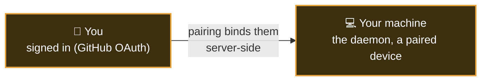
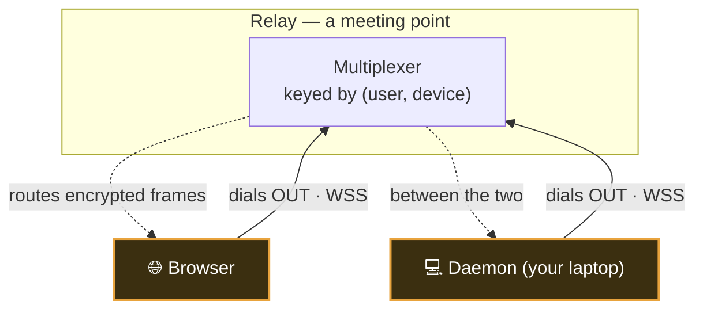
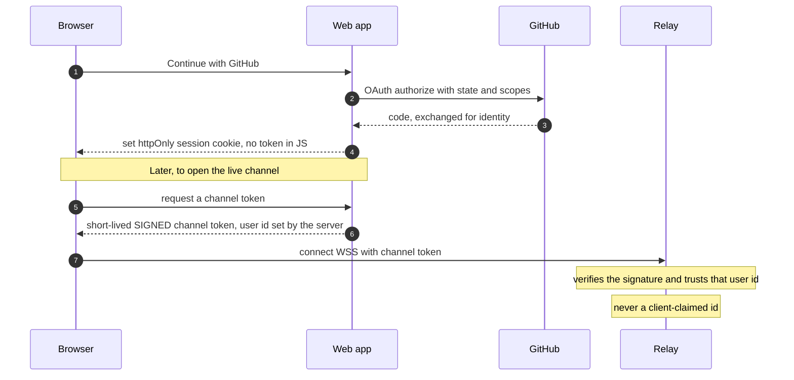
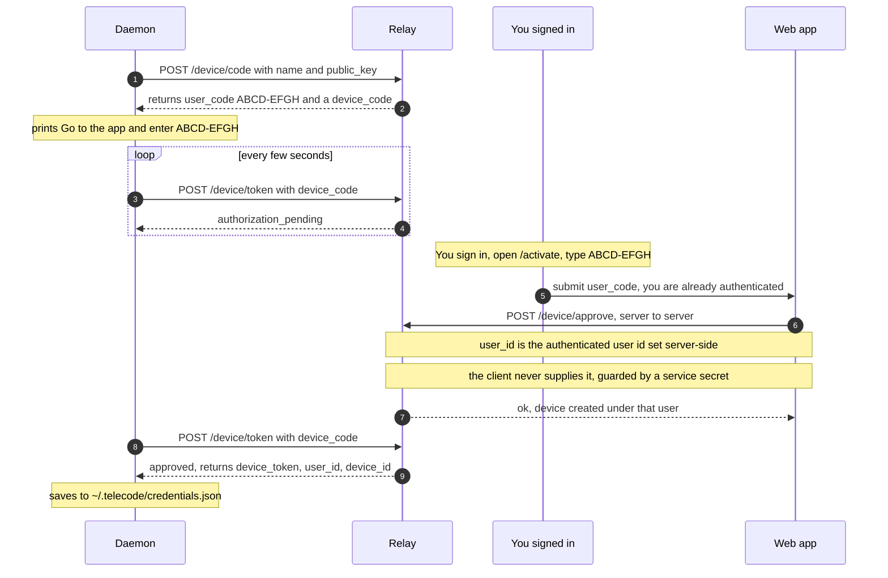
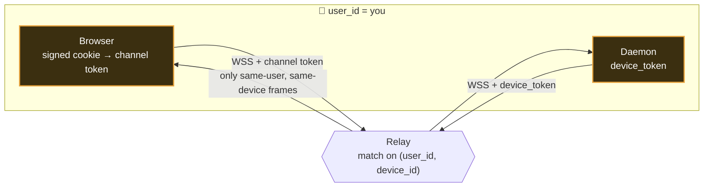

# Connecting your machine — pairing, identity & a secure channel

Telecode lets you drive coding agents that run on **your own computer** from a browser anywhere. That
raises two trust questions, and this page answers both in plain language:

1. **How do we connect your browser to your laptop securely**, when your laptop is at home behind a
   router with no open ports?
2. **How do we know it's _you_** — that the machine someone just paired belongs to _exactly_ the person
   signed in, and that the live connection is really that user?

The short version: there are **two identities** — _you_ (a signed-in user) and _your machine_ (a paired
device) — and telecode binds them together in a way the client can't fake.

---

## Nothing reaches _into_ your machine

First, the shape of the connection — because it's what makes this safe by default.

Your laptop sits behind NAT (a home router); there's no public address to call and no port to open. So
telecode is **outbound-only**: both your **browser** and your **daemon** _dial out_ to the relay, and the
relay just multiplexes messages between the two outbound connections. **Nothing ever connects inward to
your laptop.**

Both connections are **WSS** (WebSocket over TLS). The relay matches a browser to a daemon only when
they belong to the **same `(user_id, device_id)`** pair — that routing key is the backbone of everything
below. (On top of this channel, the actual session content is **[end-to-end encrypted](end-to-end-encryption.md)**,
so even the relay can't read it.)

---

## Identity #1 — knowing it's _you_ (sign-in)

You prove who you are by signing in with **GitHub OAuth**. Telecode uses the **backend-for-frontend
(BFF)** pattern, which keeps the sensitive bits on the server and out of the browser:

- The **web app** (SvelteKit) runs the OAuth dance and, on success, sets a **`httpOnly` session cookie**.
  `httpOnly` means JavaScript can't read it — so injected script can't steal your session.
- The browser never gets a long-lived API token. Instead, when it opens its live WebSocket to the relay,
  the web server hands it a **short-lived, signed channel token** that says "this connection belongs to
  user X." The relay verifies that signature; it **never trusts a user id supplied by the client.**

The takeaway: **your identity is decided server-side and signed.** The browser can't claim to be someone
else, because it never gets to _state_ who it is — the server bakes that into a token the relay verifies.

---

## Identity #2 — pairing your machine (and binding it to you)

Now the part that connects a _machine_ to _you_. The daemon has no browser and no cookie, so telecode
uses the **OAuth 2.0 Device Authorization Grant** ([RFC 8628](https://datatracker.ietf.org/doc/html/rfc8628))
— the same "enter this code" flow a TV app uses to log into your account.

Here's the whole dance. Watch where the **user id** comes from — that's the crux.

### Why this proves "exactly you"

The security hinges on **step 8**: approval is **server-derived**. When you type the code on `/activate`,
your browser doesn't send a user id — it can't. The web server, which already knows who you are from your
`httpOnly` session, calls the relay's `/device/approve` endpoint **server-to-server** (guarded by a
shared service secret) and passes **its own authenticated `user_id`**. So the device is bound to the
exact person who was signed in when they entered the code — there is no field a malicious client could
set to claim someone else's account.

Several smaller defenses harden the short window where a `user_code` is live:

- **Short, unambiguous codes.** The `user_code` (e.g. `ABCD-EFGH`) is drawn from an alphabet with no
  `0/O/1/I`, and **expires in ~5 minutes**.
- **Brute-force lockout.** Too many invalid approve attempts by a user (default **10 in 10 minutes**)
  locks further attempts — so a `user_code` can't be guessed at scale.
- **Tokens are stored hashed.** The device token is shown to the daemon **once**; the relay stores only
  its **SHA-256 hash**. A database leak doesn't reveal a usable token.
- **One-time delivery.** Once the daemon polls and receives the approved token, the pending record is
  consumed — a replayed poll can't re-read it.

After pairing, the daemon holds a `device_token` plus its `user_id` and `device_id` in
`~/.telecode/credentials.json`. From then on it just **dials out** with that token and is recognized as
that one device under that one user — no re-pairing on restart.

---

## Putting it together — the steady state

Once you're signed in and your machine is paired, every reconnect is just the two sides dialing out and
the relay matching them on `(user_id, device_id)`:

- The **browser** authenticates with the server-signed **channel token** (Identity #1).
- The **daemon** authenticates with its **device token** (Identity #2).
- The relay only ever connects a browser to a daemon when **both resolve to the same user and device** —
  and even then, it's forwarding **[end-to-end-encrypted](end-to-end-encryption.md)** frames it can't
  read.

And remember the execution boundary on top of all this: even with a valid connection, **every
consequential tool call pauses for your approval** before it runs on your machine (the
[threat model](threat-model.md) covers that gate).

---

## How it's built (for contributors)

- **Wire contracts** for the device grant are shared zod schemas in
  [`packages/protocol/src/device-auth.ts`](../packages/protocol/src/device-auth.ts), so the daemon and
  relay can never drift.
- **Daemon side** (the RFC 8628 client) is [`packages/daemon/src/pairing.ts`](../packages/daemon/src/pairing.ts):
  request code → prompt → poll → store credentials.
- **Relay side** is [`apps/relay/src/device-auth.ts`](../apps/relay/src/device-auth.ts): `/device/code`,
  `/device/token`, and the **service-secret-guarded** `/device/approve` whose `user_id` is always the
  web tier's authenticated user — never the client's.
- **Web side**: the OAuth provider + `httpOnly` cookie live under `apps/web/src/lib/server/auth`, and the
  code-entry screen is the `/activate` route; the channel token is minted by the web server for the live
  relay connection.

---

**Related:** [End-to-end encryption](end-to-end-encryption.md) (how the public keys exchanged at pairing
secure the actual content) · [Threat model](threat-model.md) (the approval gate and what the relay can
infer) · [Getting started](getting-started.md) (do it for real) · [Self-hosting](self-hosting.md) (own
the relay too).
