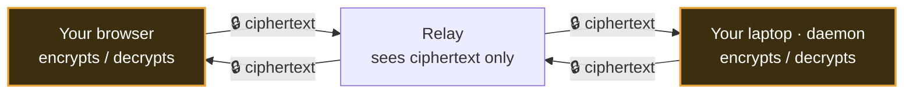
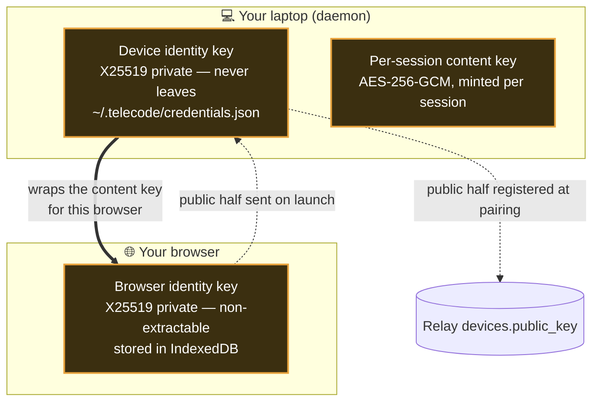
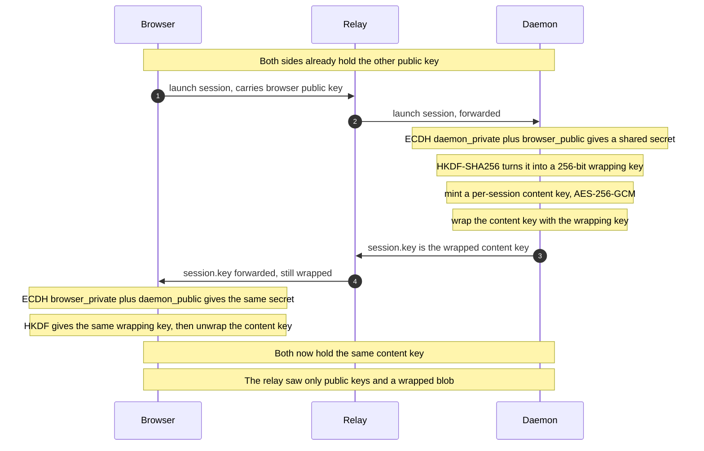
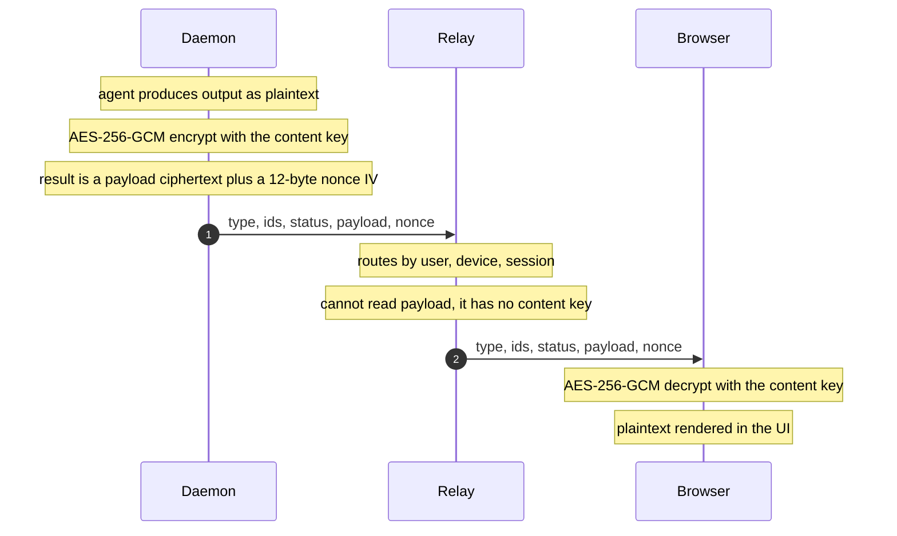

# End-to-end encryption

Telecode runs coding agents on **your** machine and lets you drive them from a browser. In between sits
a **relay** — a small server both your laptop and your browser dial out to, which passes messages
between them. End-to-end encryption (E2E) is the promise that **the relay only ever sees scrambled
bytes**: your prompts, the agent's replies, file diffs, and the whole transcript are encrypted on one
end and only decrypted on the other. The relay in the middle cannot read any of it — even though every
message flows through it.

This page explains, in plain language, how that works and how it's built. If you only remember one
picture, remember this:



The two amber boxes are the only places anything is ever readable. The relay is deliberately in the
dark.

> **Want the adversary's-eye view** — exactly what the relay _can_ still infer (timing, sizes, which
> session is busy), and the known limitations? That's the **[threat model](threat-model.md)**. This page
> is the "how it works"; the threat model is the "what's still exposed."

---

## The idea in one minute

Imagine you and your laptop each have a **padlock** that only you can open. Before any real message is
sent, you swap padlocks so each side can lock a box only the _other_ can open. Then, for the actual
session, you agree on a single fast key and lock every message with it. The courier (the relay) carries
locked boxes back and forth and never holds a key.

Telecode does exactly this, with standard cryptography built into every modern browser and into Node.js
— **no custom crypto, no native dependencies**:

| Plain idea                               | The actual primitive                                                                                   |
| ---------------------------------------- | ------------------------------------------------------------------------------------------------------ |
| Each side's personal padlock             | An **X25519** key pair (a public half anyone can have, a private half that never leaves)               |
| Swapping padlocks to get a shared secret | **ECDH** — combine _your private_ key with _their public_ key and both sides arrive at the same secret |
| Turning that secret into a real key      | **HKDF-SHA256** — stretches the raw shared secret into a clean 256-bit key                             |
| Locking each message, fast               | **AES-256-GCM** — symmetric encryption that also detects tampering                                     |

All of it runs through the platform's **WebCrypto** (`crypto.subtle`) — in the browser, and in the daemon
on Node 22+. The crypto lives in one place, [`packages/protocol/src/webcrypto.ts`](../packages/protocol/src/webcrypto.ts);
nothing in the app encrypts on its own.

---

## The three keys

There are exactly three kinds of key. Two are long-lived **identities**; one is a short-lived
**per-session** key.



1. **The device identity key.** When the daemon first runs, it generates an X25519 key pair. The
   **private** half is written to `~/.telecode/credentials.json` and _never leaves your laptop_. The
   **public** half is registered with the relay when you pair the machine (it's stored as
   `devices.public_key`). Public keys are public by definition — there's nothing secret about them.

2. **The browser identity key.** Each browser holds its own X25519 key pair. Its private half is a
   **non-extractable `CryptoKey`** kept in the browser's IndexedDB. "Non-extractable" is the important
   word: the page can _use_ the key to decrypt while it's on the real telecode origin, but **no script
   can ever read the raw key out** — so even a malicious injected script can't copy it and walk away.
   Because it's persisted, reopening the app on the same device reuses the same identity (no
   re-handshake).

3. **The per-session content key.** This is the fast symmetric key (AES-256-GCM) that actually locks the
   session's messages. The **daemon mints a fresh one for each session**, and hands it to your browser
   _wrapped_ (encrypted) so only that browser can unwrap it.

---

## The handshake (what happens when you launch a session)

When you launch a session, the browser and the daemon do a one-time handshake to agree on the session's
content key. The relay carries the messages but learns nothing it could decrypt with.



The magic of ECDH is in steps 3 and 7: each side combines **its own private key** with **the other
side's public key**, and — by the math of the curve — both arrive at the _identical_ shared secret,
without that secret ever crossing the wire. The relay sees the public keys (harmless) and the _wrapped_
content key (a blob it has no key to open).

If you open the same session in a second browser tab or on your phone, the daemon simply wraps the same
content key for that browser's public key too — so one session can be watched from several places, each
decrypting locally. The key is (re)delivered on every **subscribe**, not just at launch, so a browser
that arrives late to a session can always decrypt it.

---

## A message's round trip

Once the handshake is done, every session message — in **both** directions — is sealed with the content
key using AES-256-GCM before it touches the wire.



A few details worth knowing:

- The wire envelope carries a `nonce` — that's the 12-byte GCM **initialization vector**, fresh per
  message. GCM also produces an authentication tag, so if anyone (including the relay) flips a single
  bit, decryption **fails loudly** rather than returning garbage. Encryption here is also _integrity_.
- One encrypted frame **fans out** to every browser watching the session — the relay copies the same
  ciphertext to each subscriber; each decrypts it locally.
- A couple of fields stay in cleartext **on purpose**, because the relay needs them to route and to show
  a session list without decrypting anything: the message `type`, the lifecycle `status` (`running`,
  `awaiting_input`, `done`, …), and the routing ids. Never the content — and not the session's
  **identity** either: the title, working directory, and branch a session displays travel as **sealed
  metadata** under the same content key, stored by the relay as an opaque blob.

---

## What the relay sees — and never sees

| The relay **sees** (routing metadata)                  | The relay **never sees**                          |
| ------------------------------------------------------ | ------------------------------------------------- |
| That a session exists; its id, owning user, and device | Your prompts                                      |
| Message `type` and lifecycle `status`                  | The agent's output, messages, and diffs           |
| Timing and approximate message sizes                   | Tool names and tool inputs                        |
| Public keys (public by definition)                     | The session transcript                            |
| The _wrapped_ content key (a blob it can't open)       | Session titles, working directories, branch names |
|                                                        | Any private key, or the per-session content key   |

That metadata exposure is **real and not hidden in v1** — see the threat model. If you don't want a
third party to see even that, **[run your own relay](self-hosting.md)**; then the only party that sees
the metadata is you.

---

## How it's built (for contributors)

- **One crypto module.** Every primitive lives in
  [`packages/protocol/src/webcrypto.ts`](../packages/protocol/src/webcrypto.ts): generate/import identity
  keys, derive the shared key (ECDH → HKDF), generate/import the content key, and `sealPayload` /
  `openPayload` (AES-GCM). No component rolls its own crypto.
- **Typed key handles.** The WebCrypto handle types are aliased from Node's `webcrypto` namespace so the
  same code typechecks in the browser and the daemon; raw bytes are fed to `subtle.*` through a small
  helper. Node 22+ is required because it speaks the same spec `X25519` the browsers do.
- **Thin cipher seams.** The browser and the daemon each wrap the session in a `session-cipher` seam, so
  the encrypt/decrypt boundary is a single, testable place rather than scattered calls.
- **The browser's key is XSS-resistant by construction.** It's a non-extractable `CryptoKey` persisted
  in IndexedDB ([`apps/web/src/lib/keystore.ts`](../apps/web/src/lib/keystore.ts)); script can use it but
  never read it.
- **One unrelated use of `tweetnacl` remains** — sealing the relay's stored GitHub OAuth token _at rest_
  in the database. That's a server-side secret-at-rest concern, separate from the session E2E path.

### Verifying it yourself

The guarantee is enforced by a test and is observable in the relay's own logs.

```sh
# 1. Automated: a full encrypted session across a real relay + real daemon, asserting every forwarded
#    frame is ciphertext and the relay logs contain no plaintext and no payload at all.
pnpm --filter @telecode/relay test -- e2e-session

# 2. By hand: run the stack, launch a session, then confirm the relay log holds no session content.
make run
grep -i 'payload\|prompt' .run-state/relay.log   # → routing metadata only, never a prompt or message
```

---

## Known limitations (v1)

- **Relay-brokered key exchange.** The relay relays the public keys between browser and daemon, so a
  _malicious_ relay could in principle substitute keys (a man-in-the-middle). The daemon's key is
  registered over TLS at pairing and connections use WSS, but **out-of-band key verification isn't
  implemented yet**. Self-hosting removes the untrusted-relay assumption entirely.
- **Relay-cached ciphertext.** To make reopening a session instant, the relay keeps a small bounded ring
  of the most recent **ciphertext** frames (plus the latest wrapped `session.key`). It's still
  ciphertext the relay can't read — it just shortens time-to-first-paint on reconnect. The daemon stays
  the authoritative source.

---

**Related:** [Threat model](threat-model.md) (what's still exposed and how to verify) ·
[Connecting your machine](connecting-your-machine.md) (how the public keys get exchanged at pairing, and
how we know a machine belongs to exactly you) · [Self-hosting](self-hosting.md) (remove the untrusted
relay).
